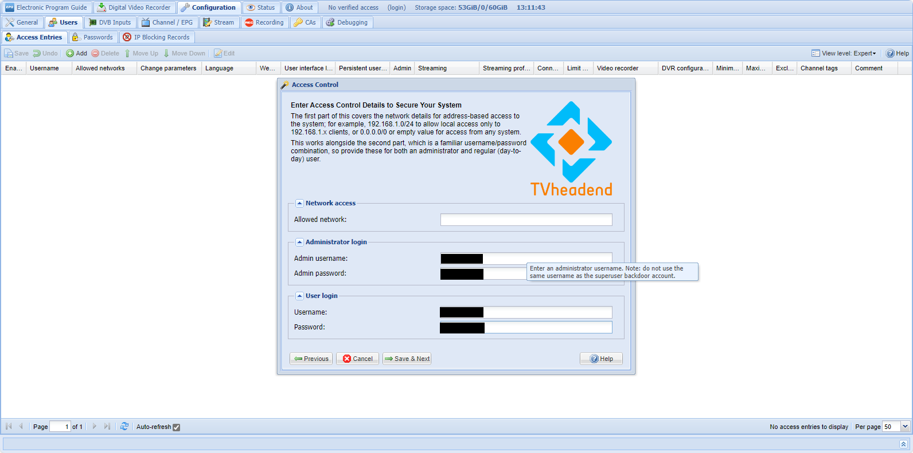
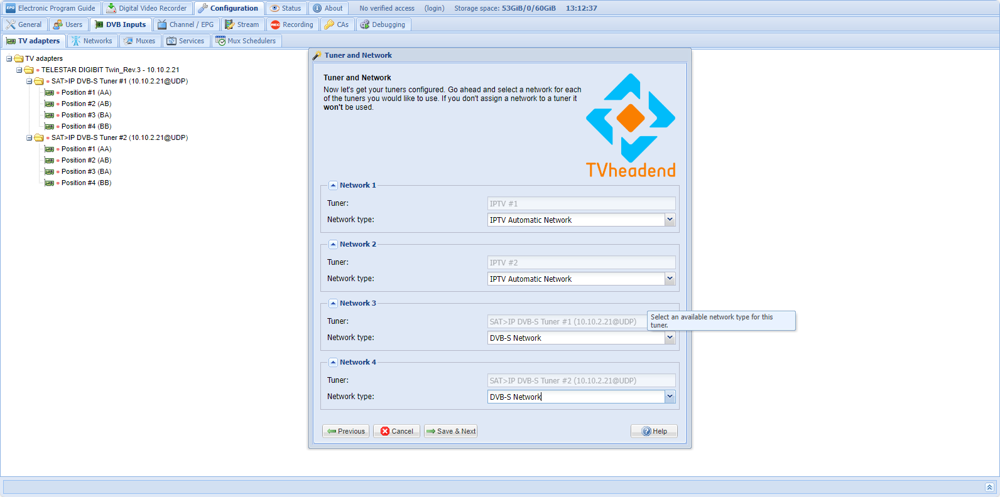
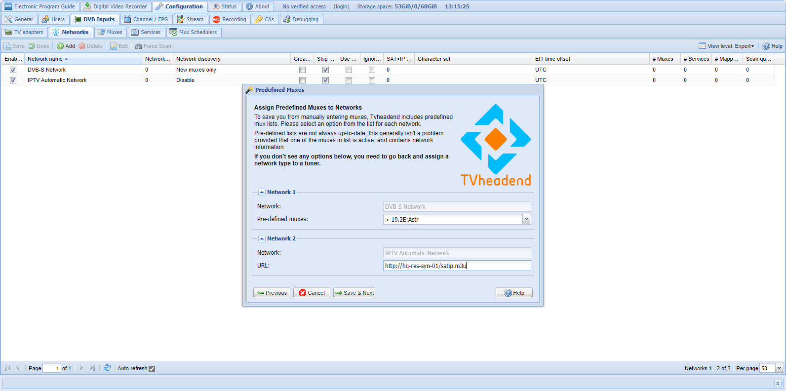
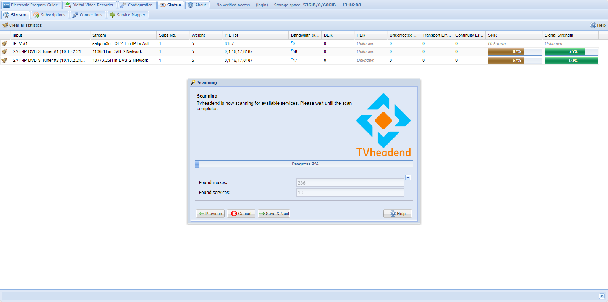
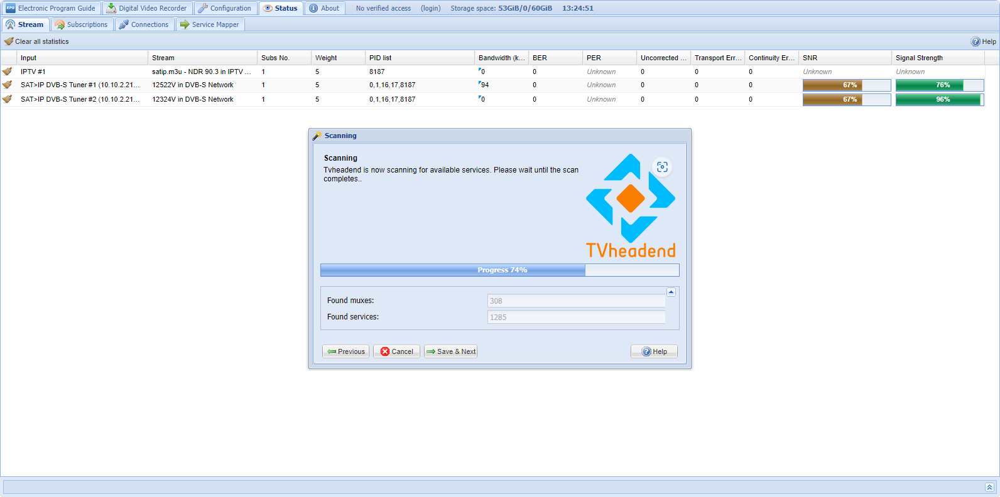
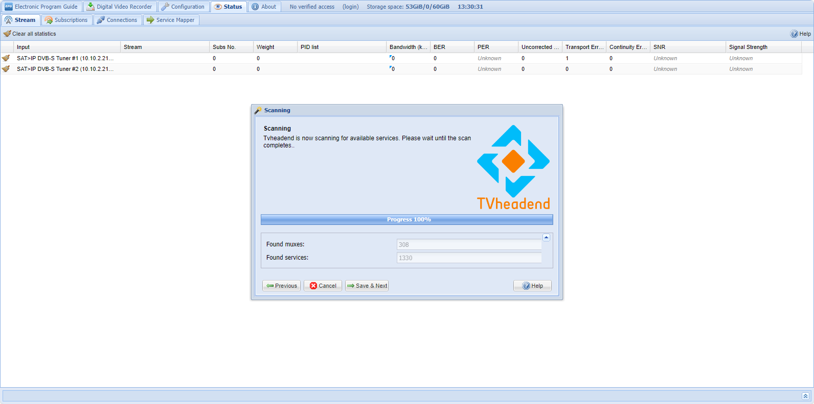
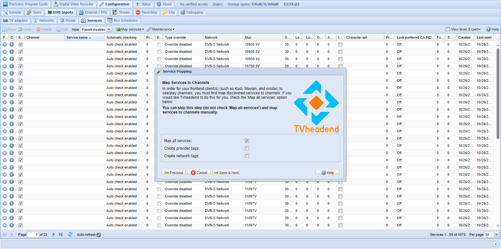
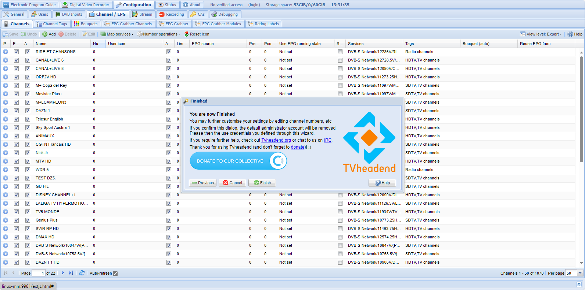
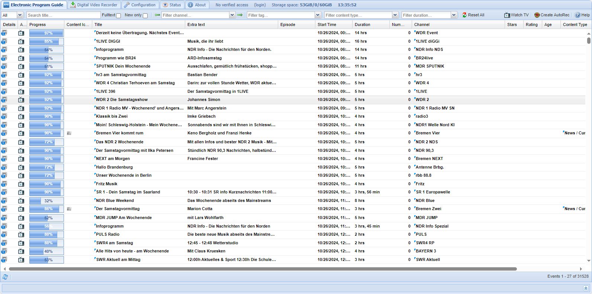

# Install TvHeadend for Telestar Digibit Twin

As Kodi was not able to process the Telestar Digibit Twin streams using the builtin [Simple IPTV Client] correctly (or I was not able to configure it correctly), I've searched the web and found that some users were successfully using it by adding TvHeadend. 

## Installation

I've followed the steps in the official documentation for [Install TVHeadend for Linux](https://docs.tvheadend.org/documentation/installation/linux).

The actual installation step was missing, but htat was fixed by running

    sudo apt install tvheadend

The installer asks for the "superuser" username and password, but that will be replaced later (see below).

After installation, the software starts a webserver running at [http://yourserver:9981](http://yourserver:9981), where one can access the software - by default the first start wizard will then run.

## Setup (Wizard)

As I could not find a lot of information about how to correctly setup TvHeadend, here are the steps I took using the setup wizard (I've installed it on a linux VM):

Start page:

Tuner and Network setting (this is really important!):

Setup muxes (I use Astra 19.2E and the hosted IPTV list - see [REAME.md](./README.md)):

Scanning (takes maybe 10 minutes):

Map services to channels (auto):

Finished!:

Everything si working, the EPG shows data:

## Notes and Hints

- Alternative Web frontend: [https://github.com/davidborzek/tvhgo](https://github.com/davidborzek/tvhgo)
- Android TVHClient: [https://github.com/rsiebert/TVHClient](https://github.com/rsiebert/TVHClient)
- TVHeadend mobile client [https://github.com/polini/TvheadendMobileUI](https://github.com/polini/TvheadendMobileUI)