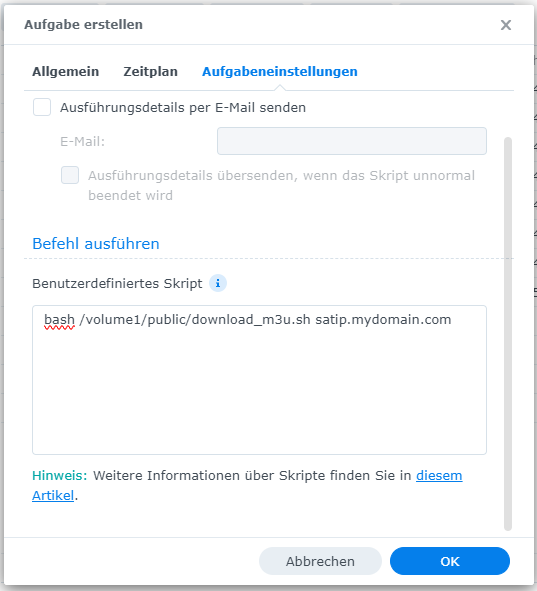
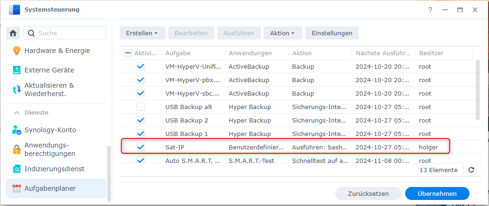

# Synology download script

This script solves a problem I had with the default `sat.ip` DNS name - even though I host my own 
domain and DNS server (and my DHCP server correctly deployed the default DNS domain name), 
I was not able to make any client correctly resolve the `sat.ip` hostname (though `sat.ip.mydomain` worked).

It seems like I could not correctly configure my DNS (Windows active directory), but I did not want to
fiddle too long nor break something, so I decided to host the m3u list on my synology and
automatically search/replace the `sat.ip` hostname with my Telestar Digbit Twin's actual hostname...

The script can be run on the Synology as a scheduled task (either once on maybe every Month) and mainly
does the following things:

- download the current Astra192e m3u list from (https://github.com/dersnyke/satipplaylists/)[https://github.com/dersnyke/satipplaylists], the actual link is (satip_astra192e.m3u)[https://github.com/dersnyke/satipplaylists/raw/refs/heads/main/satip_astra192e.m3u]
- run sed to replace all `rtsp://sat.ip` urls with the first command line argument (see below on how to set this up)
- copy the modified `*.m3u` file to `volume1/web/` to be published through WebStation
- change the owner to `http:http` so the file is accessible

## Install on synology

To install the script, copy it to `/volume1/public/` (or wherever you want).

Go to `Control Panel` > `Task Scheduler` and select `Create` > `Scheduled Task` > `User-defined Script`, then setup
how you want to run it (I'll run it weekly to catach the latest updates). Run the userdefined script as follows (replace `satip.mydomain.com` with the hostname of your Sat>IP server):

```bash
bash /volume1/public/download_m3u.sh satip.mydomain.com
```



The script will save the modified `*.m3u` file to `/volume1/web/satip.m3u`. If [WebStation](https://kb.synology.com/en-global/DSM/help/WebStation/application_webserv_desc) is running with its default setup, the file should then be available at [http://yoursynology.domain/satip.m3u](http://yoursynology.domain/satip.m3u).


## Test

To run the script once, select it in the task list and click the `Run`button in the header:



To check, if the file is generated correctly, use a web browser and access the file at [http://yoursynology.domain/satip.m3u](http://yoursynology.domain/satip.m3u).

## TODO

- maybe also download the EPG data...?
